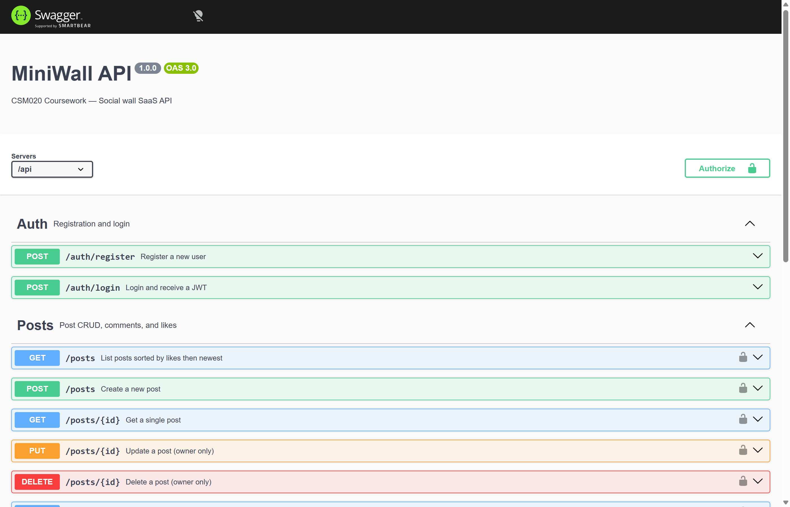
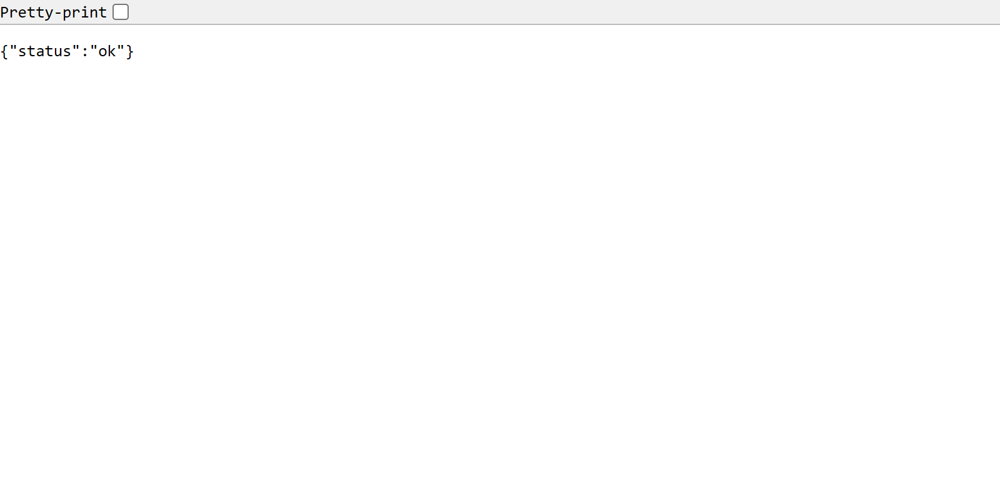

# CSM020 Cloud Computing — MiniWall SaaS API
## Technical Report

**Student:** Bartlomiej Kaszowski
**GitHub Repository:** https://github.com/Zukashi/miniwall
**Deployed URL:** http://34.45.90.152:3000
**Swagger Docs:** http://34.45.90.152:3000/api/docs

---

## 1. Introduction

Running on Google Cloud, MiniWall uses Node.js, TypeScript, and MongoDB to deliver a REST-style service. Authentication lets users post content, reply to others, give likes, while searching through entries using terms, authors, or time windows. Instead of bare metal setup, containers shape the environment - Docker wraps everything neatly. Deployment lands on a virtual machine hosted under GCP's Compute Engine umbrella. Every code update flows automatically thanks to workflows triggered in GitHub Actions. What follows walks step-by-step through how it came together, highlighting choices that shaped each stage.

---

## 2. Phase A — Project Setup

Every piece of the project runs on TypeScript turned up tight, blocking whole groups of mistakes before they happen. What slips through never makes it past the build step thanks to early checks on data shapes. Settings lock the compiler down with `target: ES2020`, making sure modern features work right. It bundles files using `module: commonjs` so imports behave predictably across modules. Built code spills into `dist`, kept apart from where things start in `src`. This split keeps everything tidy without extra effort.

### Dependency choices

| Category | Package | Justification |
|---|---|---|
| Web framework | `express` | Minimal, widely supported, large ecosystem |
| Database ODM | `mongoose` | Schema validation, middleware hooks, and TypeScript generics |
| Authentication | `jsonwebtoken`, `bcryptjs` | Industry-standard JWT; bcryptjs chosen over bcrypt for pure-JS portability |
| Validation | `express-validator` | Declarative, chainable validators integrated into route middleware |
| Rate limiting | `express-rate-limit` | One-liner protection against brute-force attacks |
| Logging | `morgan` | HTTP request logging with minimal configuration |
| API docs | `swagger-ui-express`, `swagger-jsdoc` | Auto-generated interactive docs from JSDoc annotations |
| Testing | `jest`, `ts-jest`, `supertest`, `mongodb-memory-server` | In-process MongoDB removes dependency on external database in CI |

### Project structure

Inside `src/`, files sit grouped by what they handle. Each piece lives where it fits best:

```
src/
  config/       db.ts, constants.ts, swagger.ts
  middleware/   auth.ts, errorHandler.ts, validate.ts
  models/       User.ts, Post.ts, PostSearch.ts
  routes/       auth.ts, posts.ts, search.ts
  types/        express.d.ts
  app.ts        Express app (no listen)
  server.ts     Entry point — connects DB then starts listener
tests/
  miniwall.test.ts
```

Inside `src/config/constants.ts`, HTTP status codes sit alongside default pagination values, validation boundaries, and rate-limit windows - grouped neatly to remove scattered numeric literals across files. The file `express.d.ts` steps in to expand Express's built-in `Request`, tucking a user object onto it: `{ id: string; username: string }`. That detail flows into each route handler, carrying identity data with full type support baked in.

### API endpoints and Swagger documentation

The Swagger UI at `/api/docs` lists all available endpoints with request/response schemas:



The health check endpoint confirms the server is running:



---

## 3. Phase B — JWT Authentication

### User model

A person signing up gives a name - kept between three and thirty letters, one of a kind. Email address goes lowercase, must be different every time. Secret word gets set aside without showing up later on queries, hidden by default through `select: false`. Before saving anything, a trigger spins the secret into scrambled form using bcrypt, ten rounds deep. Each account can test a provided phrase against its stored scramble through a personal checker named `comparePassword`. That function leans on bcrypt again, just checks if what you typed matches.

### Authentication routes

| Method | Path | Description |
|---|---|---|
| POST | /api/auth/register | Validates input, creates user, returns JWT + user object |
| POST | /api/auth/login | Verifies credentials, returns JWT + user object |

A single set of express-validator guidelines shapes both paths. One rule inspects email structure, adjusting it through `normalizeEmail()`. Passwords must carry a number - no exceptions, minimum eight characters. Usernames? Only letters, numbers, or underscores allowed there. When validation stumbles, the response arrives fast: status code 422, nothing more. The payload wraps issues neatly inside an object keyed as "errors".

What comes back on success is an object holding both a token and user details - specifically ID, username, and email - not just the token alone. This lines up with how REST usually works, where you send back the full new item.

### JWT middleware

Inside `src/middleware/auth.ts`, the code pulls out the `Authorization: Bearer <token>` value from the request. Using `jwt.verify`, it checks whether the token is valid, otherwise access gets blocked. When verification passes, the extracted data lands on `req.user` for later use. No token, a broken format, or one past expiry triggers a 401 error immediately. That specific response means the user isn't recognized at all. If they are recognized but lack permission, the system replies with 403 instead. This split between unproven identity and denied access stays clear across every endpoint.

### Rate limiting

Within `app.ts`, two boundaries take effect:
- `/api/auth/*`: 10 requests per 15 minutes per IP, protecting against credential stuffing.
- All `/api/*` routes: 100 requests per 15 minutes per IP, protecting against general abuse.

How long tokens last comes from the `JWT_EXPIRES_IN` setting in the environment, set by default to `7d`. This setup allows adjustments without touching code - a choice made on purpose for better operational control, documented clearly inside `.env.example`.

---

## 4. Phase C — CRUD API

Every path that handles posts stays locked down by a check called `authenticate`, set once across the whole routing system.

### Endpoint table

| Method | Path | Auth | Description |
|---|---|---|---|
| GET | /api/posts | Required | Paginated list sorted by likes desc, then newest first |
| POST | /api/posts | Required | Create post |
| GET | /api/posts/:id | Required | Single post with populated owner and comments |
| PUT | /api/posts/:id | Required (owner) | Update title/description |
| DELETE | /api/posts/:id | Required (owner) | Delete post |
| GET | /api/posts/:id/comments | Required | All comments for a post |
| POST | /api/posts/:id/comment | Required (non-owner) | Add a comment |
| DELETE | /api/posts/:id/comment/:commentId | Required (commenter) | Delete own comment |
| POST | /api/posts/:id/like | Required (non-owner) | Like a post |
| DELETE | /api/posts/:id/like | Required | Remove own like |
| GET | /api/search | Required | Search by title, owner, date range |

### Post model

```
Post {
  _id:         ObjectId
  title:       String (3–100 chars, required)
  description: String (10–1000 chars, required)
  owner:       ObjectId → User (immutable)
  likes:       [{ _id: ObjectId, user: ObjectId → User }]
  comments:    [{ _id: ObjectId, user: ObjectId → User, text: String, createdAt: Date }]
  createdAt:   Date (auto, immutable)
  updatedAt:   Date (auto-managed by Mongoose timestamps)
  likeCount:   Number (virtual — computed from likes.length, not stored)
}
```

Likes and comments live inside posts as nested pieces, not apart. Because of how MiniWall will be used, pulling a post grabs everything at once - no stitching data later. Updating happens cleanly, all at once, every time. Every like or comment has its own `_id`, so removing just one is straightforward.

A number called `likeCount` shows up automatically when data is sent out, thanks to `toJSON: { virtuals: true }` on the schema. People using the API get this ready-made count each time, built right into the response.

### Sorting and pagination (GET /api/posts)

Counting stuff means MongoDB needs more than a basic `find()`. That's why the list route leans on an aggregation pipeline instead. Sorting by something calculated pushes things into heavier machinery:

1. `$addFields` — computes `likeCount: { $size: "$likes" }` per document
2. `$sort` — `{ likeCount: -1, createdAt: -1 }` (most liked first, then newest)
3. `$lookup` — joins the users collection to get the owner's username (with `$project` to exclude password)
4. `$facet` — runs two sub-pipelines in parallel: one for the paginated data slice, one for the total count

The response envelope is `{ success, data: { posts, total, page, pages } }`, giving clients all information needed for pagination UI.

### Business rules

- A user cannot comment on or like their own post (403).
- Duplicate likes are blocked (409 Conflict).
- Only the post owner can update or delete the post (403).
- Only the comment author can delete a comment (403).
- Password is excluded from all `populate()` calls via `select: '-password'`.

Checks for ownership get handled by one shared tool called `assertOwner(ownerId, userId)`, which throws a clear `ForbiddenError` when access fails, keeping route handlers tidy.

### Error handling

Every mistake gets sent to one main spot using `next(err)` - never setting status codes directly inside catch blocks. That middle layer knows four named types (`AppError`, `ForbiddenError`, `NotFoundError`, `ConflictError`) plus two Mongoose shapes (duplicate key code 11000 → 409, `CastError` → 400). Anything else lands on 500 by default. Responses always follow: `{ success: false, message: string }`.

---

## 5. Phase D — Test Cases

A fresh in-memory database runs during setup and stops when done. Jest handles checks alongside Supertest for requests. Each test lives alone, untouched by outside systems - works smoothly inside CI environments.

All fifteen coursework test cases are included, along with extra scenarios beyond requirements:

| TC | Description | Expected |
|---|---|---|
| TC1 | Register Olga, Nick, Mary | 201 each |
| TC2 | Login all three, capture tokens | 200 each |
| TC3 | GET /api/posts without token | 401 |
| TC4 | Olga creates a post | 201 |
| TC5 | Nick creates a post | 201 |
| TC6 | Mary creates a post | 201 |
| TC7 | GET /api/posts — all 3 posts visible | 200, total=3 |
| TC8 | Nick and Olga comment on Mary's post | 201 each |
| TC9 | Mary comments her own post | 403 |
| TC10 | GET /api/posts — newest post first (no likes yet) | posts[0] is Mary's |
| TC11 | GET /api/posts/:id/comments — Mary's post | 200, length=2 |
| TC12 | Nick and Olga like Mary's post | 201 each |
| TC13 | Mary likes her own post | 403 |
| TC14 | GET /api/posts/:id — Mary's post has 2 likes | likes.length=2 |
| TC15 | GET /api/posts — Mary's post first (most likes) | posts[0] is Mary's |
| Bonus | Search by title keyword | 200, matching post |
| Bonus | Search by owner username | 200, matching post |
| Bonus | Unlike (DELETE /api/posts/:id/like) | 200, likeCount drops |
| Bonus | Delete own comment | 200 |
| Bonus | Non-owner cannot delete comment/post | 403 |
| Bonus | Deleted post returns 404 | 404 |

All 33 tests pass. Running them with `--runInBand` keeps things in order since newer cases rely on what older ones set up. The `--forceExit` flag cuts everything off properly once the temporary server stops.

---

## 6. Phase E — Docker and GCP Deployment

### Dockerfile

A multi-stage build keeps the final image small:

- **Stage 1 (builder):** grabs every dependency (`npm ci`) and compiles TypeScript (`tsc`)
- **Stage 2 (runtime):** copies only `dist/` and installs production dependencies (`npm ci --omit=dev`)

Keeping dev tools, TypeScript sources, and tests out of the final build shrinks the image while limiting exposure.

### docker-compose.yml

Two services are defined: `app` (Node.js container built from Dockerfile) and `mongo` (official `mongo:7` with a named volume for persistence). The app waits for mongo's healthcheck before starting. Environment variables come from a `.env` file kept out of the repository.

### GCP Deployment

Infrastructure was provisioned on Google Cloud Platform:

- **VM:** `e2-small` instance in `us-central1-a` running Debian 12
- **OS startup script:** automatically installs Docker and Docker Compose
- **Firewall rule:** opens TCP port 3000 for external API access

Deployment steps:
1. `gcloud compute instances create miniwall-vm --machine-type=e2-small --image-family=debian-12 --image-project=debian-cloud --zone=us-central1-a`
2. Copy source files to VM via SCP
3. SSH into VM, add `.env`, run `sudo docker compose up -d --build`
4. `gcloud compute firewall-rules create allow-miniwall --allow=tcp:3000`

The API is live at `http://34.45.90.152:3000` with interactive Swagger documentation at `/api/docs`.

### Deployment verification

```
$ curl http://34.45.90.152:3000/health
{
    "status": "ok"
}

$ curl -X POST http://34.45.90.152:3000/api/auth/register \
  -H 'Content-Type: application/json' \
  -d '{"username":"demo","email":"demo@test.com","password":"Pass1234"}'
{
    "success": true,
    "token": "eyJhbGciOiJIUzI1NiIs...",
    "user": {
        "id": "69c93205d7fbbb03d2787259",
        "username": "demo",
        "email": "demo@test.com"
    }
}
```

---

## 7. Phase F — Technical Discussion

### Database design decisions

MongoDB got picked over a relational database because the main data access pattern - grabbing a post with its comments and likes - maps naturally to reading just one document. Embedding subdocuments avoids the n+1 query problem that would arise if comments and likes lived in separate collections.

The `PostSearch` collection is a deliberate denormalisation. MongoDB needs a special field for text searches, but adding a text index directly to the main Post collection could slow down writes. Instead, a slim `PostSearch` document appears alongside each post, holding just `titleLower` (text-indexed), `owner`, and `createdAt`. With any edit or removal, the matching record changes or vanishes right away.

### Security

- Passwords are hashed with bcrypt (cost factor 10), making offline brute-force attacks computationally expensive.
- JWT tokens expire after 7 days (configurable), limiting exposure if a token is stolen.
- Rate limiting on auth endpoints prevents credential stuffing.
- The `password` field carries `select: false` at the schema level, so even queries that accidentally omit `select: '-password'` never expose the hash.
- CORS is enabled via the `cors` package, allowing browser-based clients to reach the API.

### CI/CD pipeline

Two GitHub Actions workflows are in place:

- **ci.yml** — triggered on every push: installs dependencies, compiles TypeScript, runs the full test suite. Broken code never makes it to main because of this step.
- **deploy.yml** — triggered on pushes to `main` only: after tests pass, copies updated source to the GCP VM via SCP and runs `docker compose up -d --build` over SSH.

GitHub Secrets (`GCP_SSH_KEY`, `GCP_VM_IP`, `GCP_VM_USER`) store credentials outside the repository, preventing accidental exposure.

### Infrastructure as Code

Terraform configuration (`terraform/`) describes GCP resources declaratively:
- `main.tf`: `google_compute_instance` and `google_compute_firewall` resources
- `variables.tf`: parameterised inputs (project ID, region, machine type)
- `terraform.tfvars`: environment-specific values

Running `terraform apply` from scratch provisions the entire VM and firewall in a reproducible, version-controlled manner.

### Code quality

TypeScript strict mode with zero `any` types ensures all data shapes are verified at compile time. Named error classes (`ForbiddenError`, `NotFoundError`, `ConflictError`) produce consistent HTTP responses. Constants replace all magic numbers. All string inputs are trimmed and length-validated. `morgan` logs every HTTP request in development, and the centralised error handler ensures no unhandled promise rejections crash the process.

---

## 8. Phase H — Search Functionality

The search endpoint (`GET /api/search`) accepts up to four optional query parameters:

| Parameter | Type | Description |
|---|---|---|
| title | string | Full-text keyword search on post titles |
| owner | string | Filter by owner's username or ObjectId |
| from | ISO 8601 date | Posts created on or after this date |
| to | ISO 8601 date | Posts created on or before this date |

At least one parameter must be supplied; otherwise the endpoint returns 400.

The search queries the `PostSearch` collection, which has a MongoDB text index on `titleLower`. Title searches use `{ $text: { $search: title } }`. Owner searches resolve the username to an ObjectId first. Date range searches build a `{ $gte, $lte }` filter on `createdAt`. All active filters combine into a single `find()` call, then matched post IDs pull complete posts from the `Post` collection.

---

## 9. References

1. Mongoose Documentation. (2024). *Mongoose v8 Guide*. https://mongoosejs.com/docs/
2. Auth0. (2024). *JSON Web Tokens Introduction*. https://jwt.io/introduction
3. OWASP. (2021). *OWASP Top Ten*. https://owasp.org/www-project-top-ten/
4. Google Cloud. (2024). *Compute Engine documentation*. https://cloud.google.com/compute/docs
5. HashiCorp. (2024). *Terraform Language Documentation*. https://developer.hashicorp.com/terraform/language
6. MongoDB. (2024). *Aggregation Pipeline*. https://www.mongodb.com/docs/manual/core/aggregation-pipeline/

---

## Appendix A — API Endpoint Summary

*(Supplementary material — not counted in word limit)*

| Method | Path | Auth | Request Body | Success | Error codes |
|---|---|---|---|---|---|
| POST | /api/auth/register | No | `{ username, email, password }` | 201 | 409, 422 |
| POST | /api/auth/login | No | `{ email, password }` | 200 | 401, 422 |
| GET | /api/posts | Bearer | — | 200 | 401 |
| POST | /api/posts | Bearer | `{ title, description }` | 201 | 401, 422 |
| GET | /api/posts/:id | Bearer | — | 200 | 401, 404 |
| PUT | /api/posts/:id | Bearer (owner) | `{ title?, description? }` | 200 | 401, 403, 404, 422 |
| DELETE | /api/posts/:id | Bearer (owner) | — | 200 | 401, 403, 404 |
| GET | /api/posts/:id/comments | Bearer | — | 200 | 401, 404 |
| POST | /api/posts/:id/comment | Bearer (non-owner) | `{ text }` | 201 | 401, 403, 422 |
| DELETE | /api/posts/:id/comment/:cid | Bearer (commenter) | — | 200 | 401, 403, 404 |
| POST | /api/posts/:id/like | Bearer (non-owner) | — | 201 | 401, 403, 409 |
| DELETE | /api/posts/:id/like | Bearer | — | 200 | 401, 404, 409 |
| GET | /api/search | Bearer | — | 200 | 400, 401, 404 |

## Appendix B — Database Schema Summary

*(Supplementary — not counted in word limit)*

**User collection**
```
{ _id, username (unique), email (unique, lowercase), password (bcrypt, select:false),
  createdAt, updatedAt }
```

**Post collection**
```
{ _id, title, description, owner (ref: User, immutable),
  likes: [{ _id, user (ref: User) }],
  comments: [{ _id, user (ref: User), text, createdAt (immutable) }],
  createdAt (immutable), updatedAt }
  Virtual: likeCount = likes.length
  Index: { createdAt: -1 }
```

**PostSearch collection** *(denormalised for search)*
```
{ _id, postId (ref: Post, unique), titleLower (text-indexed),
  owner (ref: User, indexed), createdAt (indexed) }
```
